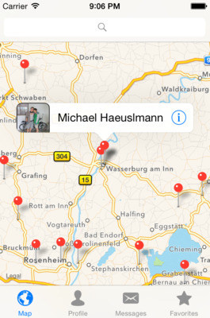

# Warmshowers iOS

Warmshowers iOS is an iPhone and iPad client for warmshowers.org, the hospitality community for cycling tourists.



## Features

 - Search for hosts on the map or through the search bar
 - Write messages to other users
 - Write feedback for hosts/guests (*)
 - Save favorite users for offline viewing
 - Change your own profile (*) 

(*) This feature while being available is only persisting locally until v0.2 is ready

## About the project


## Getting started

For those who want to build and run this project:

### Update dependencies

All the dependencies are bundled with the app (recommended by Cocoapod for reasons, that I can't really agree with), but if you want to update make sure you have `pod` installed and run `pod update`

### Set up API

Add a file `APISecrets.swift` to the `API` folder with the following contents:

```
public struct APISecrets
{
    public static let Username = “ENTER YOUR USERNAME”
    public static let Password = “ENTER YOUR PASSWORD”
}
```

(you obviously have to fill in your credentials) and then you should be good to go.

Make sure to open the XCode workspace file and not the project file, because of the Cocoapod dependencies.

## Lessons learned

Since this was my first big iOS project there were a lot of things that were new to me. Mostly I was taken by the ease with which apps can be built using Cocoa, but there were also a lot of things I didn't particularly enjoy:

 - XCode must be one of the worst IDEs in the world
 - Dependency Injection has never been more complicated
 - [Realm](https://realm.io) is very inflexible and the non-thread-safe architecture makes it less useful for more complicated apps (in my opinion)
 - developing on a Mac Mini without a SSD is also not much fun

So what would I do differently if I were to start over or what things am I going to change in the upcoming milestones:

 - replace [Realm](https://realm.io) with SQLite3, because it is thread-safe and more importantly, because other Warmshower volunteers coming from other languages will feel right at home
 - switch to XCode 7 and Swift 2 as soon as possible, because then there's no excuse to not improve the test coverage
 - extract sources and delegates from some of the more bloated controllers 

## Thanks

If it weren't for the following projects and people I could not have realized this project in such a short time and I sure as hell would not have had as much fun doing so.

### People

 - First and foremost Randy Fay for creating [Warmshowers](https://www.warmshowers.org)
 - Paul Hagarty from Stanford for his awesome CS 193P course

### Projects

 - [Alamofire](https://github.com/Alamofire/Alamofire) for being an awesome HTTP Client
 - [BrightFutures](https://github.com/Thomvis/BrightFutures) for making working with asynchronous requests easy and safe
 - [Haneke](https://github.com/Haneke/HanekeSwift) for caching everything you throw at it
 - [Toucan](https://github.com/gavinbunney/Toucan) for making image manipulation super easy
 - [Fuzzy Autocomplete](https://github.com/FuzzyAutocomplete/FuzzyAutocompletePlugin) is probably my most beloved XCode plugin, it makes working with all the weird Swift naming conventions sooo much easier 